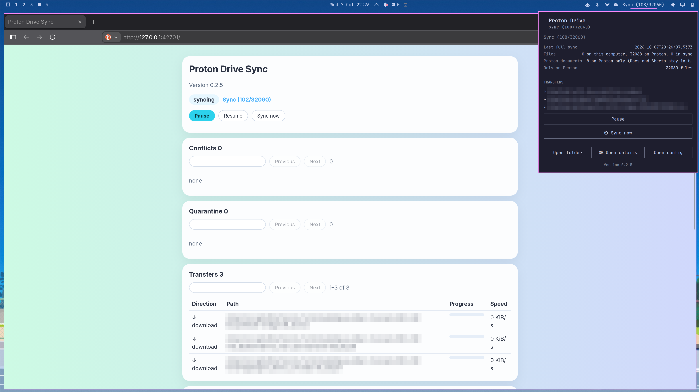

# Proton Drive Sync



Use Proton Drive Sync to keep a folder on your machine in sync with a folder in Proton Drive. When you create, edit, rename, or move a file on either side, the other side follows. If you delete a file, it is not erased: on your machine it goes to a recycle folder, and in Proton Drive it goes to Trash. A large delete or replace waits for you. If both sides change the same file, you keep both copies.

You sign in and reach Proton Drive through Proton's official [Drive SDK](https://github.com/ProtonDriveApps/sdk). The account code in this repository is a Node port of that SDK. The two-way sync on top of it is this project's own code.

Proton does not ship a sync client for Linux yet. Until Proton releases its own, you can use this unofficial plugin on Omarchy. It is not affiliated with Proton AG or the Omarchy project.

Have fun!

## Install

```sh
omarchy plugin add https://github.com/zakkoo/proton-drive-sync.git --enable
```

That is the whole install. You get a chip on the right of the built-in bar. You need that bar. A replacement bar cannot see this plugin's service.

The sync engine ships in this repository as one committed file, `dist/cli/main.js`, with Proton's SDK and every other dependency already inside. Adding the plugin fetches nothing else, runs no package manager, and writes nothing outside your own data. The engine starts from the plugin folder once you have signed in and chosen your folders, and stops with the shell.

## Sign in

Click the chip. Choose Sign in. A terminal opens Proton's own page, and your password stays there. Then name your local folder and your remote folder, for example `/my-files`, and confirm. Nothing is written until you do.

## Day to day

The chip tells you what the engine is doing. Open it to pause, resume, sync now, confirm or reject a held change, keep one side of a conflict, or release a file the engine refused to touch. Open folder and Open config show up once a sync pair is saved. Open details shows up while the engine is running.

The same engine answers from a terminal:

```sh
~/.config/omarchy/plugins/io.github.zakkoo.proton-drive/bin/proton-drive-sync doctor
```

`doctor` reports whether you are signed in, configured, and running. `details` prints the loopback details page for the engine you are running.

## Update

```sh
omarchy plugin update io.github.zakkoo.proton-drive
```

`omarchy plugin update` fast-forwards your installed plugin to the latest published commit. If you have edited that plugin folder yourself, it is left as it is. The engine is part of the plugin, so the chip and the engine update together; restart the shell, or sign out and in, so the running engine is the new one. Your sync folder, Proton session, and config stay.

If you installed a version before 0.3.0, the engine used to be built into `~/.local/share` and run from a user service. The plugin removes that old copy, its launcher, and its service the first time the new version loads. Only files carrying this plugin's marker are touched.

## Remove

```sh
omarchy plugin remove io.github.zakkoo.proton-drive
```

`omarchy plugin remove` takes the chip off your bar and stops the engine with it. It does not delete your sync folder, your Proton session, or the tool's config. Your files stay.

## What it needs

- Omarchy with the built-in bar. The plugin runs unsandboxed, with your user privileges, inside the shell
- Node.js 24 or newer, which Omarchy installs for you. The engine looks in `/usr/bin` and in Omarchy's mise directory, never on your PATH
- A Secret Service for your Proton session, which Omarchy already runs
- `@protontech/drive-sdk`, `@protontech/crypto`, `dbus-next`, and `picomatch`, pinned by this repo's lockfile and bundled into the committed engine
- A Proton account

The project is MIT. See `LICENSE`. The adapted Proton code keeps Proton's own MIT notice in `src/remote/proton/LICENSE-proton.md`.

## Development

The engine and the reasons for it are in `src/ARCHITECTURE.md`.

```sh
npm run check
npm run test -- --project e2e
npm run test:fault
```

`./scripts/ci.sh` is the full gate. Run it on Node 24. It ends by rebuilding `dist/cli/main.js` and fails if the result differs from the committed file, so the bundle under review is always the one these sources produce. Rebuild it yourself with `npm run build`; `sha256sum dist/cli/main.js` gives the hash to quote in a release.
